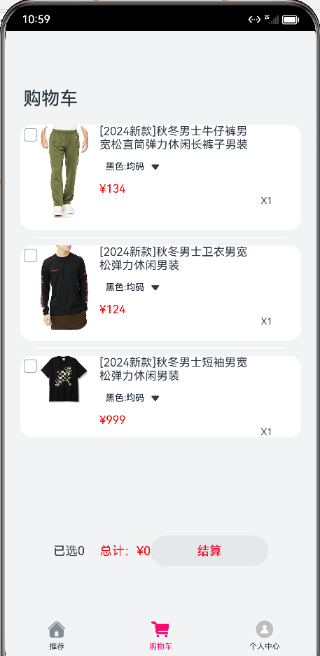
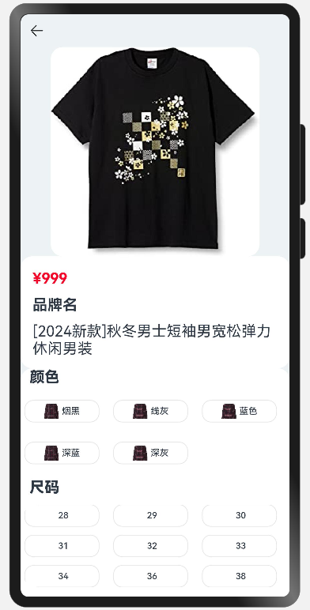

# 鸿蒙-开发-电商AppUI-仿唯品会
#### 项目说明
这是一个鸿蒙开发的仿唯品会电商app模板，开发语言是ArkTS,目前已实现以下功能。

#### 已实现功能
1. 推荐页-（轮播图、大牌闪购+发现好物UI、今日特卖UI-支持左右滑动、发现频道UI、广告ListUI)
2. 女装Tab页-（服装种类UI-支持多种分类、格状品牌展示-Grid-UI）
3. 男装Tab页-（瀑布流-商品卡片浏览UI、支持点击进入商品详情页[商品图+价格+标题+颜色分类+尺寸分类+数量展示]
4. 运动Tab页+电脑办公Tab页
5. 购物车页（商品数量计算 + 订单金额计算）
6. 个人中心页（个人头像+昵称，我的订单，功能区）

#### 页面展示

#### 软件架构
1.  开发语言：ArkTS
2.  开发环境：windows10
3.  开发工具：DevEco Studio https://developer.harmonyos.com/cn/develop/deveco-studio#download

#### 参与贡献

1.  Fork 本仓库
2.  新建 dev_xxx 分支
3.  提交代码
4.  新建 Pull Request
